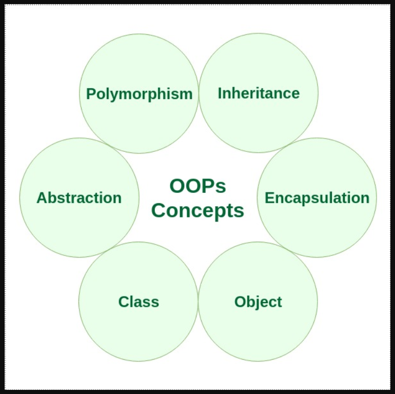

# C++ OOPS Concepts

The main aim of OOP is to bind together the data and the functions that operate on them so that no other part of the code can access this data except that function.



Reference: https://gist.github.com/krishnadey30/cb64bf875f29b5a6c91f79ea38a2ba4e , chartgpt, google and many more..
## Class
It is a user-defined data type, which holds its own data members and member functions, which can be accessed and used by creating an instance of that class. A class is like a blueprint for an object.

- The only **difference between a structure and a class** is that structure members have **public access** by default and class members have **private access** by default

The **::** operator in C++ is called the **scope resolution operator**. It is used to define or access members (variables or functions) of a class, struct, or namespace that are outside the current scope

## Static Member functions in C++
A function is made static by using static keyword with function name. These functions work for the class as whole rather than for a particular object of a class.

## Object
An Object is an identifiable entity with some characteristics and behaviour. **An Object is an instance of a Class**. When a class is defined, **no memory is allocated** but when it is instantiated (i.e. an object is created) memory is allocated.

## Encapsulation
It refers to the **bundling of data (variables) and methods** (functions) in a class
- encapsulation restricts direct access to some of the object's components, which is typically achieved by setting access levels like `private`, `protected`, or `public`.

### Key Points of Encapsulation in C++
- Access Specifiers:
    - Private: Members declared as private can only be accessed within the class itself. They are hidden from outside access.
    - Protected: Members declared as protected are accessible within the class itself and in derived (child) classes.
    - Public: Members declared as public can be accessed from outside the class.
- Getters and Setters:
    - You can use public methods, known as getters (to retrieve data) and setters (to modify data), to provide controlled access to the private data members.
- Data Hiding:
    - By marking data members as private
- Advantages:
    - Data Integrity: Encapsulation helps protect the internal state of an object from unintended or harmful modifications.
    - Maintainability: Changes to the internal implementation of a class won't affect the code that uses the class.
    - Modularity: By grouping related data and functions into a class, you promote a modular structure, making it easier to manage code.
- Encapsulation also leads to **data abstraction** or hiding.

## constructor
In C++, a constructor is a **special member function** of a class that is automatically called when an **object of the class is created.** Its primary purpose is to initialize the data members of a class.
### Types of Constructors in C++:
Default Constructor:
- If you **don’t define a constructor**, C++ provides a **default constructor automatically**.
- If you define any constructor **with parameters**, the default constructor is **not provided automatically**.

Parameterized Constructor:

Copy Constructor:
- A constructor that creates a new object as a copy of an existing object.
- It takes a reference to an object of the same class as an argument and initializes the new object with the values of the existing object.

```
class Example {
public:
    int x;
    // Parameterized constructor
    Example(int val) {
        x = val;
    }

    // Copy constructor
    Example(const Example& obj) {
        x = obj.x;
    }
};

int main() {
    Example obj1(10);     // Parameterized constructor called
    Example obj2 = obj1;  // Copy constructor called
    cout << obj2.x;       // Output: 10
}
```
### Special Characteristics of Constructors:
Constructor Overloading: C++ allows multiple constructors within the same class as long as they have different signatures. This is called constructor overloading.

No Return Type: Constructors do not have a return type, not even void.

Automatic Invocation: A constructor is called automatically when an object of the class is created, and it cannot be invoked explicitly like normal member functions.

Implicit and Explicit Constructor Calls: Constructors can be called implicitly by creating an object or explicitly using the constructor syntax.

destructor: 
- A destructor in C++ is a special member function of a class that is automatically called when an object is destroyed or goes out of scope. The destructor is used to perform any necessary cleanup, such as releasing resources, closing files, or freeing dynamically allocated memory.

## virtual function
A virtual function in C++ is a member function in a base class that is declared using the keyword virtual and is intended to be overridden by derived classes

**Note:-** Base class pointer can hold a Derived class object but vice versa is not true

It allows **Runtime polymorphism**, which means that the appropriate function is selected based on the object type at runtime rather than compile time.

Using **Base Class Pointers**:
- A pointer to a derived class is a pointer of a base class pointing to a derived class, but it will hold its aspect.
- This pointer of the base class will be able to temper functions and variables of its own class and can still point to the derived class object.
- You can store a derived class object in a pointer of the base class type. This avoids object slicing and allows access to derived class members through virtual functions (polymorphism).
```
#include <iostream>
using namespace std;

// Base class
class Animal {
public:
    // Virtual function
    virtual void sound() {
        cout << "This is a generic animal sound" << endl;
    }
};

// Derived class 1
class Dog : public Animal {
public:
    // Override the virtual function
    void sound() override {
        cout << "Dog barks" << endl;
    }
};

// Derived class 2
class Cat : public Animal {
public:
    // Override the virtual function
    void sound() override {
        cout << "Cat meows" << endl;
    }
};

int main() {
    Animal* animal;  // Pointer to base class
    
    Dog dog;
    Cat cat;
    
    // Point to a Dog object
    animal = &dog;
    animal->sound();  // Output: Dog barks (due to virtual function)
    
    // Point to a Cat object
    animal = &cat;
    animal->sound();  // Output: Cat meows (due to virtual function)
    
    return 0;
}

output:
Dog barks
Cat meows
```
Explanation of the Example:
- Virtual Function in Base Class:
- Overriding in Derived Classes:
- Base Class Pointer:
- Polymorphism:
## Abstraction
Abstraction means displaying only essential information and hiding the details.

In C++, abstraction can be achieved using:

**1. Abstract Classes:** These are classes that cannot be instantiated on their own and serve as a **blueprint for derived classes**. They often contain at **least one pure virtual function**, which forces derived classes to provide specific implementations.
```
#include <iostream>
using namespace std;

// Abstract class
class Shape {
public:
    // Pure virtual function (no implementation here)
    virtual void draw() = 0;
    
    // Virtual function with a default implementation
    virtual void color() {
        cout << "Default color is black" << endl;
    }
};

class Circle : public Shape {
public:
    // Provide specific implementation of the pure virtual function
    void draw() override {
        cout << "Drawing a circle" << endl;
    }
    
    // Override the color function
    void color() override {
        cout << "The color of the circle is blue" << endl;
    }
};

class Rectangle : public Shape {
public:
    // Provide specific implementation of the pure virtual function
    void draw() override {
        cout << "Drawing a rectangle" << endl;
    }
    
    // Use the default color implementation from the Shape class
};

int main() {
    Shape* shape1 = new Circle();
    Shape* shape2 = new Rectangle();
    
    shape1->draw();   // Output: Drawing a circle
    shape1->color();  // Output: The color of the circle is blue
    
    shape2->draw();   // Output: Drawing a rectangle
    shape2->color();  // Output: Default color is black (inherited behavior)

    // Clean up dynamic memory
    delete shape1;
    delete shape2;

    return 0;
}

output:
Drawing a circle
The color of the circle is blue
Drawing a rectangle
Default color is black

Explanation:

Abstract Class (Shape):

Shape is an abstract class that defines a pure virtual function draw(). This means any derived class must implement this function. You can't create an object of Shape directly because it contains pure virtual functions, making it abstract.
Pure Virtual Function (draw()):

The draw() function is declared as a pure virtual function (= 0), meaning derived classes like Circle and Rectangle must provide their specific implementations.
Partial Abstraction (color()):

The color() function in the Shape class is a regular virtual function with a default implementation, which derived classes can override if they choose to.
Implementation in Derived Classes:

The Circle class provides its own implementation of both draw() and color(), while the Rectangle class only provides the draw() implementation and inherits the default behavior of color().
Pointer to Base Class:

Shape* shape1 = new Circle(); allows us to use a pointer to the abstract base class (Shape) to refer to derived class objects (Circle and Rectangle). This is an example of polymorphism, where the exact method called (for draw() or color()) depends on the object type at runtime.
```


**2. Interfaces:** In C++, interfaces are not defined explicitly like in some other languages (e.g., Java), but they are **achieved using abstract classes with only pure virtual functions**. These classes define the "what" (methods that must be implemented) without providing the "how" (the actual implementation).

**Conclusion:**
Abstraction in C++ allows you to define what an object does through interfaces (abstract classes) without exposing how it does it. This makes your code more modular, maintainable, and easier to extend by focusing only on the essential details and hiding unnecessary implementation complexities.

## Inheritance
It allows a class to inherit properties and behaviors (methods) from another class.

- Sub Class: The class that inherits properties from another class is called Sub class or Derived Class.
- Super Class: The class whose properties are inherited by sub class is called Base Class or Super class.

### Basic Syntax of Inheritance:
- class Subclass : public Superclass
- class Subclass : Superclass   // By default its private inheritance
- class subclass : protected Superclass

Types of Inheritance:
Single, Multiple, Multilevel, Hierarchical, and Hybrid Inheritance


### Points to Remember:
- Whether derived class's default constructor is called or parameterised is called, **base class's default constructor is always called before derived** inside them.
- To call base class's parameterised constructor inside derived class's parameterised constructor, we must mention it explicitly while declaring derived class's parameterized constructor.
```
class Derived : public Base { 
 int y;
    public:
    // parameterized constructor
    Derived(int j):Base(j) { 
        y = j;
        cout << "Derived Parameterized Constructor\n";
    }
};
```
- All the Base class's constructors are called inside derived class's constructor, in the same order in which they are inherited.
```
class A : public B, public C ;
In this case **first B class constructor** is called followed by C class then finally A class;
```
## Polymorphism
Polymorphism is one of the core concepts of Object-Oriented Programming (OOP) in C++. It allows objects of different classes to be treated as objects of a common base class, and it provides the ability to use a single interface to represent different types. 
### In C++, polymorphism is mainly divided into two types:
- Compile-time Polymorphism (Static Polymorphism)
- Runtime Polymorphism (Dynamic Polymorphism)

### Compile-time Polymorphism (Static Polymorphism)
Compile-time polymorphism is achieved through function overloading and operator overloading. The decision about which function to invoke is made at compile-time.

#### Function Overloading
Function overloading allows multiple functions with the same name but different parameter types or counts to coexist.
```
#include <iostream>
using namespace std;

class Example {
public:
    void print(int i) {
        cout << "Integer: " << i << endl;
    }
    void print(double d) {
        cout << "Double: " << d << endl;
    }
    void print(string s) {
        cout << "String: " << s << endl;
    }
};

int main() {
    Example obj;
    obj.print(5);         // Calls print(int)
    obj.print(3.14);      // Calls print(double)
    obj.print("Hello");   // Calls print(string)
    return 0;
}
```
#### Operator Overloading
Operator overloading allows defining how operators work with user-defined types (classes/structs).
```
#include <iostream>
using namespace std;

class Complex {
private:
    int real, imag;
public:
    Complex(int r = 0, int i = 0) : real(r), imag(i) {}
    
    // Overloading the '+' operator
    Complex operator + (const Complex& obj) {
        Complex temp;
        temp.real = real + obj.real;
        temp.imag = imag + obj.imag;
        return temp;
    }
    
    void print() {
        cout << real << " + " << imag << "i" << endl;
    }
};

int main() {
    Complex c1(3, 4), c2(1, 2);
    Complex c3 = c1 + c2; // Calls the overloaded '+' operator
    c3.print();
    return 0;
}
```
### Runtime Polymorphism (Dynamic Polymorphism)
Runtime polymorphism is achieved using inheritance and virtual functions. The decision about which function to invoke is made at runtime, and this allows for flexibility in cases where derived classes provide different implementations of functions defined in the base class.

#### Virtual Functions
In runtime polymorphism, a virtual function is a function in the base class that is expected to be overridden in derived classes. When a function is declared as virtual, the base class ensures that the derived class's version of the function is called, even when using a base class pointer/reference to an object of the derived class.
```
#include <iostream>
using namespace std;

class Base {
public:
    virtual void show() {  // Virtual function
        cout << "Base class show" << endl;
    }
    void display() {
        cout << "Base class display" << endl;
    }
};

class Derived : public Base {
public:
    void show() override {  // Override virtual function
        cout << "Derived class show" << endl;
    }
    void display() {
        cout << "Derived class display" << endl;
    }
};

int main() {
    Base *basePtr;      // Base class pointer
    Derived derivedObj; // Derived class object
    basePtr = &derivedObj;
    
    // Calls Derived class's show function (runtime polymorphism)
    basePtr->show();  // Outputs: Derived class show
    
    // Calls Base class's display function (no polymorphism, static binding)
    basePtr->display(); // Outputs: Base class display
    return 0;
}
```
Key Points:
- Virtual functions enable runtime polymorphism.
- The base class pointer (or reference) is used to point to a derived class object.
- The overridden function in the derived class is invoked, not the base class function.
- For polymorphism to work, the function in the base class must be declared virtual, and the derived class can override it.

#### Pure Virtual Functions and Abstract Classes
A pure virtual function is a virtual function that has no implementation in the base class and must be overridden in the derived class. A class that contains at least one pure virtual function is called an abstract class, and it cannot be instantiated.
```
#include <iostream>
using namespace std;

class Shape {
public:
    virtual void draw() = 0; // Pure virtual function
};

class Circle : public Shape {
public:
    void draw() override {
        cout << "Drawing Circle" << endl;
    }
};

class Square : public Shape {
public:
    void draw() override {
        cout << "Drawing Square" << endl;
    }
};

int main() {
    Shape *shape1 = new Circle();
    Shape *shape2 = new Square();
    
    shape1->draw();  // Outputs: Drawing Circle
    shape2->draw();  // Outputs: Drawing Square
    
    delete shape1;
    delete shape2;
    return 0;
}
```
#### Key Points about Pure Virtual Functions:
- A class containing at least one pure virtual function is an abstract class.
- Abstract classes cannot be instantiated directly; they can only be used as base classes.
- Derived classes must implement the pure virtual function, otherwise, they will also be abstract.

#### Virtual Destructor
In the context of inheritance, if you use a base class pointer to delete an object of a derived class, the destructor of the base class must be declared virtual to ensure proper cleanup of derived class resources.
```
#include <iostream>
using namespace std;

class Base {
public:
    Base() { cout << "Base class constructor" << endl; }
    virtual ~Base() { cout << "Base class destructor" << endl; } // Virtual destructor
};

class Derived : public Base {
public:
    Derived() { cout << "Derived class constructor" << endl; }
    ~Derived() { cout << "Derived class destructor" << endl; }
};

int main() {
    Base *basePtr = new Derived();  // Base class pointer pointing to Derived object
    delete basePtr;  // Properly calls both Base and Derived class destructors
    return 0;
}
```
Key Points:
If a base class has a virtual destructor, deleting an object through a base class pointer ensures that the derived class destructor is called first, followed by the base class destructor.


## Key Takeaways
- Polymorphism allows for different classes to be treated as instances of the same base class, either at compile-time (function overloading, operator overloading) or at runtime (virtual functions).
- Virtual functions provide dynamic dispatch, enabling runtime polymorphism.
- Pure virtual functions enforce a contract for derived classes to implement specific functions, making the base class abstract.
- Always use a virtual destructor in base classes if derived classes manage resources (like dynamic memory), to ensure proper cleanup.

Polymorphism promotes flexibility and extensibility in your code, allowing you to write more modular and maintainable software.

## This is overview of Object-oriented programming (OOP)!
