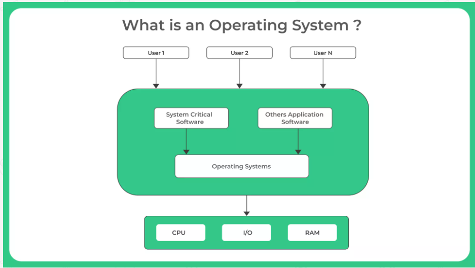

# Operating System 
An operating system is software program that manages both hardware and software resources of a computer, provides a platform for users to interact with hardware, and execute tasks efficiently.

## Main Jobs handled by OS:
    Device Management
    File Management
    Memory Management
    Process Management
    UI Management
    Storage Management
    Application Handling
