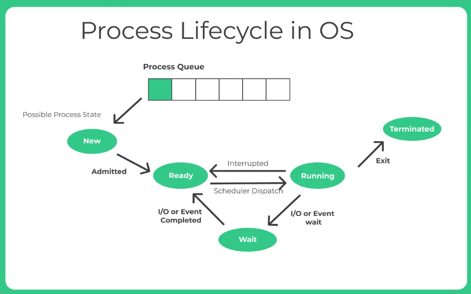
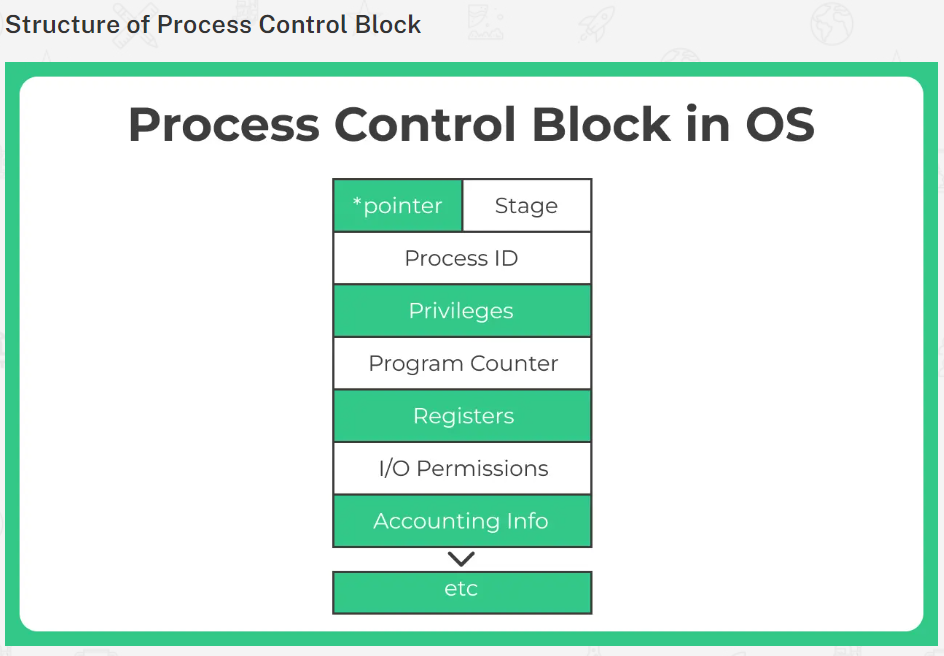

# CPU Scheduling
- Process (Intro)
- Process Life Cycle
- Process Control Block PCB
- Process Scheduling
- Context Switching
- CPU Scheduling
- FCFS Scheduling
- Shortest Job First (or SJF) scheduling – non-preemptive
- Shortest Job First (or SJF) scheduling – preemptive (SRTF)
- Round Robin scheduling
- Priority Scheduling
- Convoy Effect
- Difference between Scheduler and Dispatcher
- Preemptive scheduling vs Non Preemptive scheduling
- Preemptive scheduling
- Non preemptive scheduling

# Process in Operating System
The common process states include:
- New: This is the initial state when a process is being created.
- Ready: The process is loaded into main memory and waiting to be assigned to a processor.
- Running: The process is being executed by a processor.
- Blocked: The process is unable to execute further until a certain event occurs, such as waiting for user input or completion of I/O operations.
- Terminated: The process has completed its execution or has been forcefully terminated.
- Suspended Ready – There maybe no possibility to add a new process in the queue. In such cases its can be said to be suspended ready state.
- Suspended Block – If the waiting queue is full

Process scheduling: It determines the order in which processes are executed by the processor.
- Different scheduling algorithms, such as First-Come, First-Served (FCFS), Shortest Job Next (SJN), Round Robin (RR), and Priority Scheduling, are used to allocate CPU time to processes efficiently.

Process Creation: The process creation involves allocating necessary resources, setting up the execution environment, and initializing the process control block.

# Process Life Cycle

# process control block or PCB
PCB or Process control Block is a data structure which has all the information that is needed by a schedular to schedule a particular process, this data structure **rests in the operating system Kernel.**

Process ID or PID: This basically is an unique integer ID for a particular process being carried out.

The following are kept track of by the PCB:
- Process ID or PID – Unique Integer Id for each process in any stage of execution.
- Process Stage – The state any process currently is in, like Ready, wait, exit etc
- Process Privileges – The special access to different resources to the memory or devices the process has.
- Pointer – Pointer location to the parent process.
- Program Counter – It will always have the address of the next instruction in line of the processes
- CPU Registers – Before the execution of the program the CPU registered where the process needs to be stored at.
- Scheduling Information – There are different scheduling algorithms for a process based on which they will be selected in priority. This section contains all the information about the scheduling.
- Memory Management Information – The operating system will use a lot of memory and it needs to know information like – page table, memory limits, Segment table to execute different programs MIM has all the information about this.
- Accounting Information – As the name suggest it will contain all the information about the time process took, Execution ID, Limits etc.
- I/O Status – The list of all the information of I/O the process can use.

# Process Scheduling
The decision to move different parallel processes competing with one another for execution, to different states like Ready to running or running to exit state based on a certain decision strategy is known as Process Scheduling in Operating System.

Process Scheduling Types
- Long Term(Job Scheduling)
- Medium Term(CPU Scheduling)
- Short Term(Swapping)

**Context Switch:** A context switch is a procedure that a computer’s CPU (central processing unit) follows to change from one task (or process) to another while ensuring that the tasks do not conflict.
- Context Switch in OS
Context Switching is a cost and time saving measure performed by the CPU that is handing task 1 and has to stop executing this task to priority execute another task 2.
-  To do this effectively, the system stores the initial task in its processed form so that when this task is resumed, it can be loaded and resumed from the same progress point as earlier.