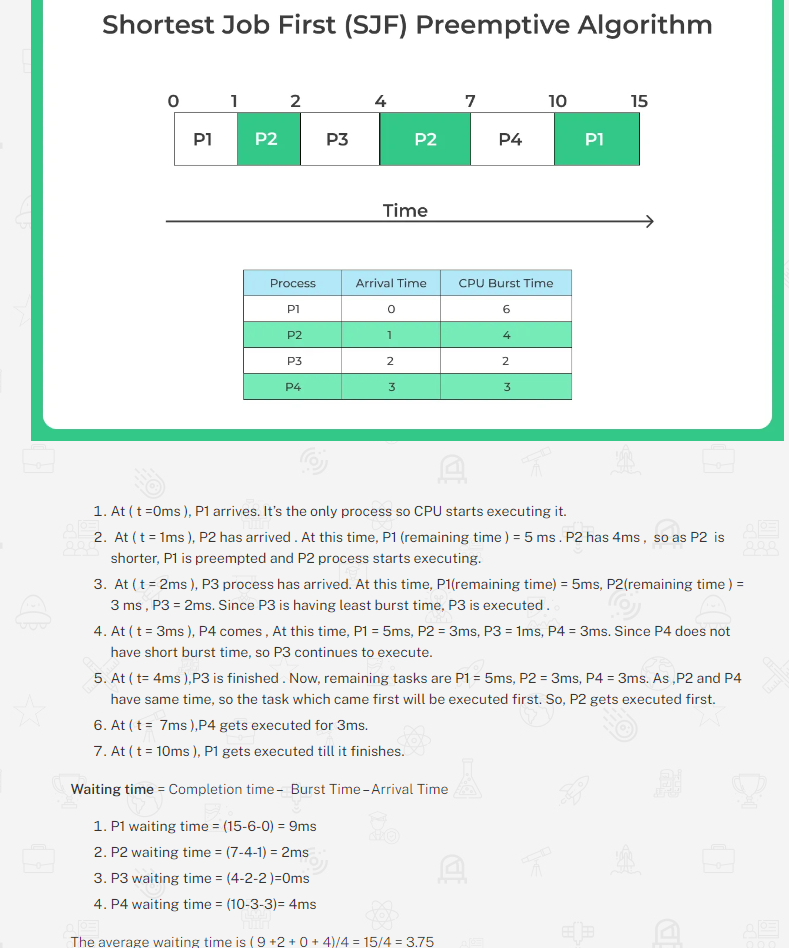

# CPU Scheduling
- Process (Intro)
- Process Life Cycle
- Process Control Block PCB
- Process Scheduling
- Context Switching
- CPU Scheduling
- FCFS Scheduling
- Shortest Job First (or SJF) scheduling – non-preemptive
- Shortest Job First (or SJF) scheduling – preemptive (SRTF)
- Round Robin scheduling
- Priority Scheduling
- Convoy Effect
- Difference between Scheduler and Dispatcher
- Preemptive scheduling vs Non Preemptive scheduling
- Preemptive scheduling
- Non preemptive scheduling

# Process in Operating System
A process is a program that is being executed in an operating system 

The common process states include:
- New: This is the initial state when a process is being created.
- Ready: The process is loaded into main memory and waiting to be assigned to a processor.
- Running: The process is being executed by a processor.
- Blocked: The process is unable to execute further until a certain event occurs, such as waiting for user input or completion of I/O operations.
- Terminated: The process has completed its execution or has been forcefully terminated.
- Suspended Ready – There maybe no possibility to add a new process in the queue. In such cases its can be said to be suspended ready state.
- Suspended Block – If the waiting queue is full

Process scheduling: It determines the order in which processes are executed by the processor.
- Different scheduling algorithms, such as First-Come, First-Served (FCFS), Shortest Job Next (SJN), Round Robin (RR), and Priority Scheduling, are used to allocate CPU time to processes efficiently.

Process Creation: The process creation involves allocating necessary resources, setting up the execution environment, and initializing the process control block.

# Process Life Cycle

# process control block or PCB
PCB or Process control Block is a data structure which has all the information that is needed by a schedular to schedule a particular process, this data structure **rests in the operating system Kernel.**

Process ID or PID: This basically is an unique integer ID for a particular process being carried out.

The following are kept track of by the PCB:
- Process ID or PID – Unique Integer Id for each process in any stage of execution.
- Process Stage – The state any process currently is in, like Ready, wait, exit etc
- Process Privileges – The special access to different resources to the memory or devices the process has.
- Pointer – Pointer location to the parent process.
- Program Counter – It will always have the address of the next instruction in line of the processes
- CPU Registers – Before the execution of the program the CPU registered where the process needs to be stored at.
- Scheduling Information – There are different scheduling algorithms for a process based on which they will be selected in priority. This section contains all the information about the scheduling.
- Memory Management Information – The operating system will use a lot of memory and it needs to know information like – page table, memory limits, Segment table to execute different programs MIM has all the information about this.
- Accounting Information – As the name suggest it will contain all the information about the time process took, Execution ID, Limits etc.
- I/O Status – The list of all the information of I/O the process can use.

# Process Scheduling
The decision to move different parallel processes competing with one another for execution, to different states like Ready to running or running to exit state based on a certain decision strategy is known as Process Scheduling in Operating System.

Process Scheduling Types
- Long Term(Job Scheduling)
- Medium Term(CPU Scheduling)
- Short Term(Swapping)

**Context Switch:** A context switch is a procedure that a computer’s CPU (central processing unit) follows to change from one task (or process) to another while ensuring that the tasks do not conflict.
- Context Switch in OS
Context Switching is a cost and time saving measure performed by the CPU that is handing task 1 and has to stop executing this task to priority execute another task 2.
-  To do this effectively, the system stores the initial task in its processed form so that when this task is resumed, it can be loaded and resumed from the same progress point as earlier.

# CPU Scheduling in Operating System
We use CPU scheduling to make efficient use of CPU to increase the CPU utility and to reduce optimize time usage.

Different types of Scheduling Algorithms –
- First come first serve (FCFS)
- Shortest Job First (SJF) – non-preemptive
- Shortest Job First (SJF) – preemptive
- Priority Scheduling
- Round Robin
- Highest Response Ratio Next (HRRN)
- Multilevel Queue Scheduling:
- Multi level Feedback Queue Scheduling
## CPU Scheduling Parameters
- CPU Burst Time – The duration for which a process gets control of the CPU is the CPU burst time, and the concept of gaining control of the CPU is the CPU burst. 

- CPU Utilization – CPU utilization can be defined as the the percentage of time CPU was handling process execution to total time. Formulae – CPU Utilization = (Total time – Total idle time)/(Total Time)

- Waiting Time is the total amount of time spent in the ready queue to gain the access of the CPU for execution.

- Turn Around Time – From the time the process is submitted to the time the process is completed, is defined as Turn Around Time.

- Throughput – In a unit time the number of processes that can be completed is called the throughput.

- Load Time – It is defined as the average number of process that are pending in the Ready Queue and waiting for execution time.

- Response Time – can be defined as the time interval between when the process was submitted and when the first response is given to the process.     

## Non Preemptive Scheduling vs Preemptive Scheduling
- Non Preemptive Scheduling($ old so No switches):
In this type of scheduling, if a process enters the CPU and gets processing time. The process will keep on executing until it has terminated or has to forcibly go to waiting state as it needs a resource that it locked by another parallel process. Example – SJF i.e. Shortest Job First (Non Preemptive)

- Preemptive Scheduling ($ new version so switches):
In this type of scheduling, if a process enters the CPU and gets processing time. It can get switched by another process that have higher priority. Example – SRTF i.e. Shortest Remaining time First (Also known as SJF – Preemptive) 

# FCFS Scheduling Algorithm 
Process which enters the system first gets the CPU time first.

It is a non preemptive type of algorithm.

Disadvantages of FCFS Algorithm
- Since, its a non preemptive algorithm thus, there is no intelligence applied and no priority can be given to processes.
- If critical system process arrives it may have to wait for a process like calculator.
- Waiting time may get too high, along with the turn around time.
- Causes starvation or convoy effect

formulas:
- Turn Around Time = Completion Time – Arrival Time   
- Waiting Time = Turnaround time – Burst Time 

# Shortest Job First Scheduling Non Preemptive
It is a process which is executed in ascending order of their burst time. The process having the shortest burst time is executed first and so on.
- SJF can be Pre-emptive or Non- preemptive. Under Non-preemptive Scheduling , once a process has been allocated to CPU, the process keeps the CPU until the process has finished its execution.

The order in which the CPU processes the process are(Gantt Chart) –

Features of SJF
- SJF is a greedy Algorithm
- It has Minimum average waiting time among all scheduling algorithms.
- Difficulty of SJF is knowing the length of next CPU request.

Drawback
- in SJF Scheduling, a process with high burst time may suffer starvation. It’s prevented by aging.
    - Aging is a technique which is used to reduce starvation of the processes.
Aging takes into account the waiting time of the process in the ready queue and gradually increases the priority of the process.
Hence, as the priority of a process gets increased this ensures that all process get completed eventually.
- Total execution time must be known beforehand of a process.

# Shortest Job First – Preemptive Scheduling 
In which the processor is allocated to the job having minimum CPU burst time, but the job can be **preempted (Replaced) by a newer job with shorter burst time.**

Shortest Job First Preemptive Scheduling is also known as Shortest remaining Time(SRT) or Shortest Next Time(SNT).

## key difference between preemptive and preemptive version of SJF.
- In preemptive version of SJF when a new process arrives at the ready queue and a previous process is not finished and is being executed. If the next CPU burst of new process is shorter than current executing process, then in preemptive version , it will stop that process and will start executing the newly arrived process.
    - The current state of the process is saved by the **context switch** and the CPU is given to another process.

- While, in non preemptive version of SJF, even if the arriving process is shorter than currently executing process, current process is not stopped . After the current process finishes , then the new process gets in the queue.

Note – If 2 processes have same execution time, then jobs are based on First Come First Serve Basis.

# Round Robin Scheduling Algorithm in Operating System
Round robin scheduling algorithm focuses on a time sharing approach where every task is executed in a cyclic manner.

Each process is given a fixed time called **quantum** for execution. After the Quantum of time passes, the current running process is **preempted** and the next process gets executed for next quantum of time.

CPU Scheduler goes around the ready queue and allocates CPU, Ready Queue is like a First In First Out Structure.

quantum executing, one of the two things will happen
- If the process has a CPU burst of less than quantum time, then as the process gets finished , CPU resources are released voluntarily. the next process in the ready queue occupies the CPU.
- If the CPU burst is larger than the quantum, the timer will go off and the process is preempted, **its state is saved by context switching and process is put at last of ready queue**. After this, the next process in the ready queue comes in CPU quantum.

Advantages –
- It does not cause starvation as all process get equal time of CPU.

Disadvantages –
- There is an overhead of context switching as mentioned earlier, too small of quantum time causes overhead and slower execution of process. So, time quantum must be large with respect to Context Switch time.