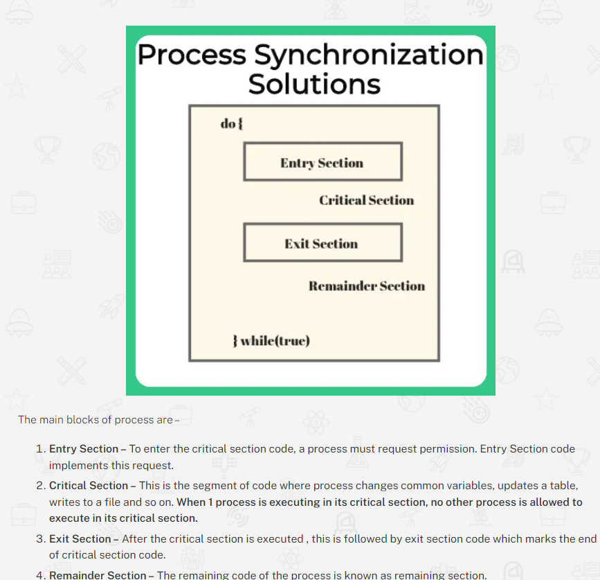
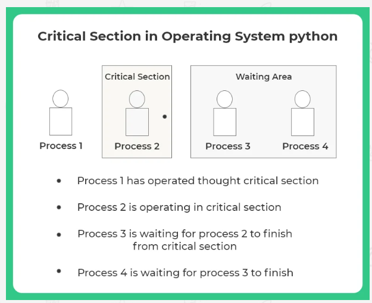
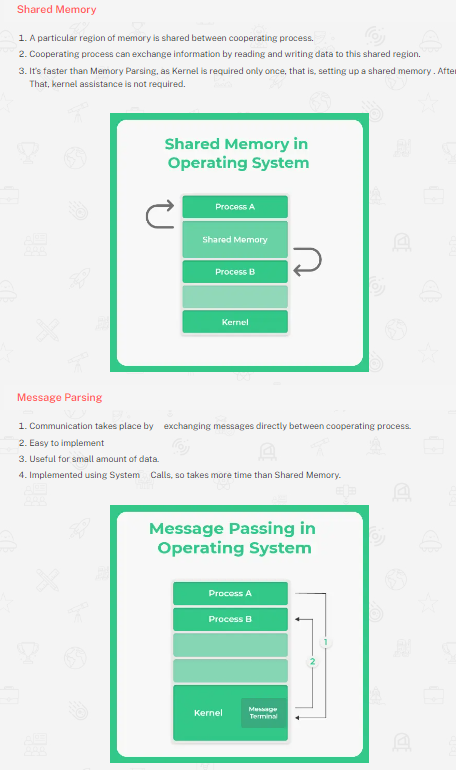
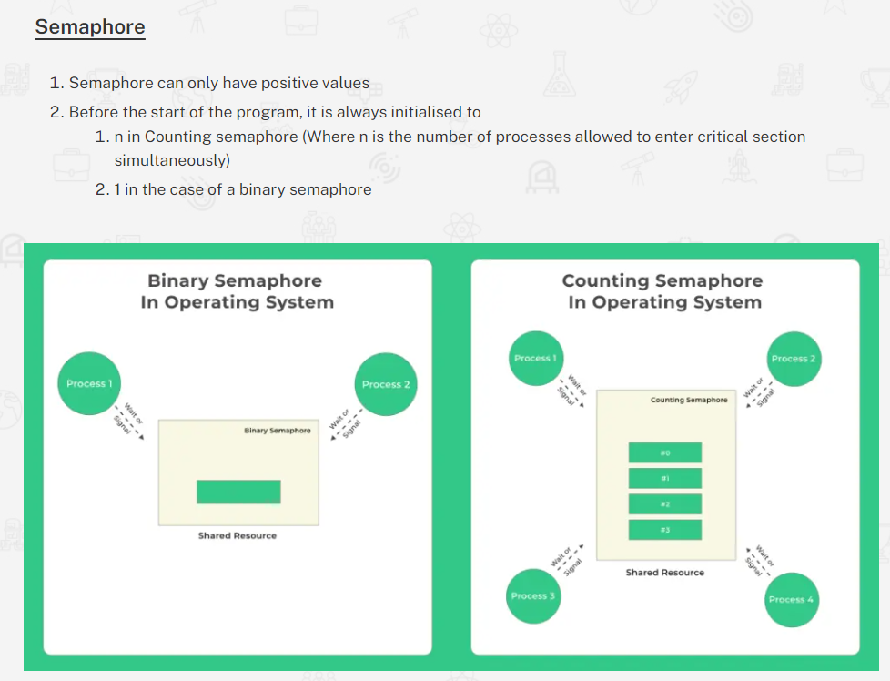

# Process Synchronization
It is a process in operating system by which memory and resources are shared by different process.

There are two ways any process can execute –
- In Concurrent Execution – the CPU scheduler switches rapidly between processes.Here, only one instruction is executed at a time.
- Parallel execution – 2 or more instructions of different process execute simultaneously on different processing cores.

Changes made by one process may override changes made by another process running parallel. Resulting in inconsistent data So, this requires processes to be synchronized.

Process Synchronization also prevents race around condition. It’s the condition in which several processes access and manipulate the same data.

### Types of Process Synchronization
- Independent Process : Execution of one process does not affects the execution of other processes.
- Cooperative Process : Execution of one process affects the execution of other processes.

### Solution for Process Synchronization
- Mutual Exclusion: Processes have to abide to this rule under this, only one process at a time is allowed to operate inside critical section. All cooperating processes should follow this.
- Progress: As the name suggests, the system must promote progress and maximum utilisation of the system. If there is no thread in the critical section then, and there are threads waiting for critical section utilisation. Then they must be allowed immediately to access critical section.
- Bounded Waiting: If a process P1 has asked for entry in its critical section. There is a limit on the number of other processes that can enter critical section. Since if a large number of processes are allowed to enter critical section. Then the process P1 may starve forever to gets its entry.
    - To further solve such situations many more solutions are available which will be discussed in detail in further posts –
        - Semaphores
        - Critical Section
        - Test and Set
        - Peterson’s Solution
        - Mutex

# Inter Process Communication in Operating System (OS)
The cooperating process(a type of process synchronization) requires Interprocess communication (IPC) mechanism(cooperating process share data and information.).

The mechanism that will allow them to exchange data and information are the following:–
- Shared memory    
- Message Passing

# Critical Section in Operating System
Critical Section is any piece of code that is shared between different processes.
- More than one process enters into critical section leads problem.
- If a single process operate in critical section and does not release it then lead to deadlock.

Refer process synchronization solution diagram ^ and

# Critical Section Problem
Critical Section problem is a classic computer science problem in many banking systems, where there are many shared resources like memory, I/O etc. Concurrent access may override changes made by other process running in parallel.

A critical solution problem satisfies 3 things
- Mutual Exclusion must be preserved.
    - If a process P1 is executing in its critical section, no other process can execute in critical section.
- Progress Requirement must be satisfied.
    -  If no process is executing in its critical section, then the decision as to which process will go next into executing its critical section code is decided by only those process which are in entry section, that is, not before it.

- Bounded waiting time requirement is met.
    -  After a certain time, the process gets to be in critical Section, doesn’t wait indefinitely. 

To handle critical section is Operating System, There are 2 ways –
- Preemptive Kernel (has Race Around Condition)
- Non  Preemptive Kernel (Doesn't allow a process running in Kernel Mode to be preempted or stopped)
    - Free from Race Around Condition as only 1 process is executed at a time in kernel.

What is Race Around Condition ?
- If many kernel processes in OS, it may lead to race around condition.

Eg – Consider a kernel data structure that maintains a list of all open files in system. List is modified if a new file is opened or closed. If 2 process simultaneously try to open files , it may separate updates to list leading to race around condition

# Mutex in OS
Mutex provides a locking mechanism,  Mutex lock in OS provides code wise functionality for mutual exclusion.
- Mutex is Binary in nature
- Operations like Lock and Release are possible
- Mutex is for Threads, while Semaphores are for processes.
- Mutex works in user-space and Semaphore for kernel
- Mutex provides locking mechanism
- A thread may acquire more than one mutex
- Binary Semaphore and mutex are different

# Semaphores in OS
While mutex is a lock (wait) and release mechanism. Semaphores are signalling mechanisms that **signal to processes the state of the Critical section in OS and grant access to the critical section accordingly.**

Semaphore Types
- Binary Semaphore –Only True/False or 0/1 values
- Counting Semaphore –Non-negative value

### Semaphore Implementation
- Wait p(s) or wait(s)- Wait decrements the value of semaphore by 1
- Signal v(s) or signal(s)- Signal increments the value of semaphore by 1

# Atomic Operations
when an atomic operation is being executed, no other process can read through or modify the data that is currently used by atomic operation.

### Type of Atomic Operations
- Fine-grained atomic operations: These operations can be implemented without any interruptions. For example, loading and storing registers.
- Coarse-grained atomic operations: These include a series of fine-grained operations which cannot be interrupted. For example a call of a synchronized method in JAVA.