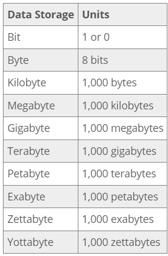
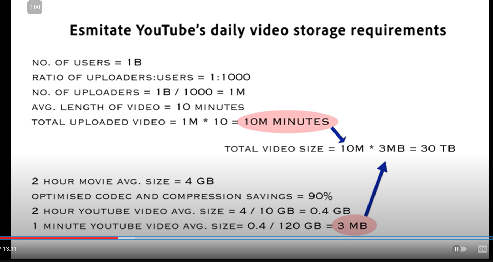
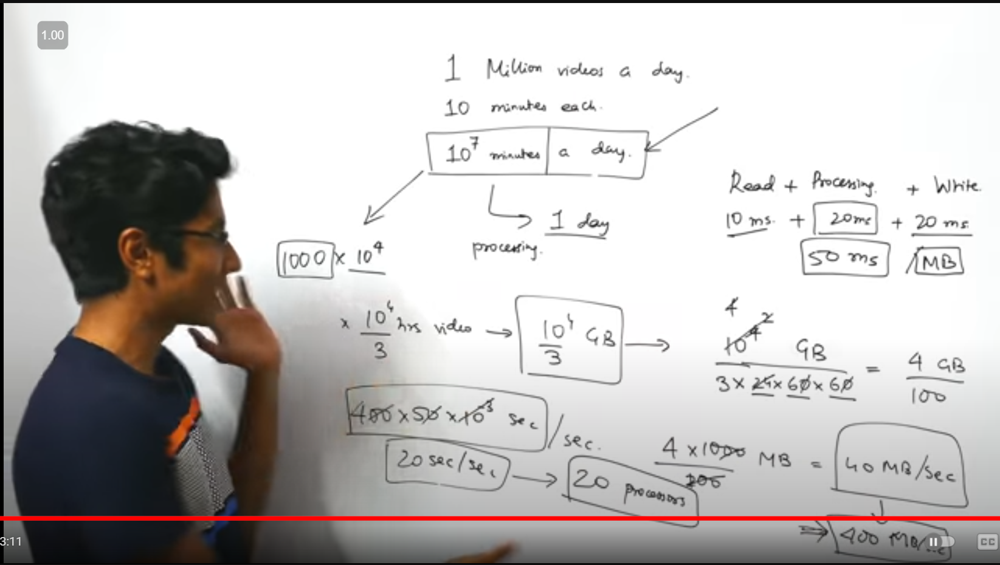
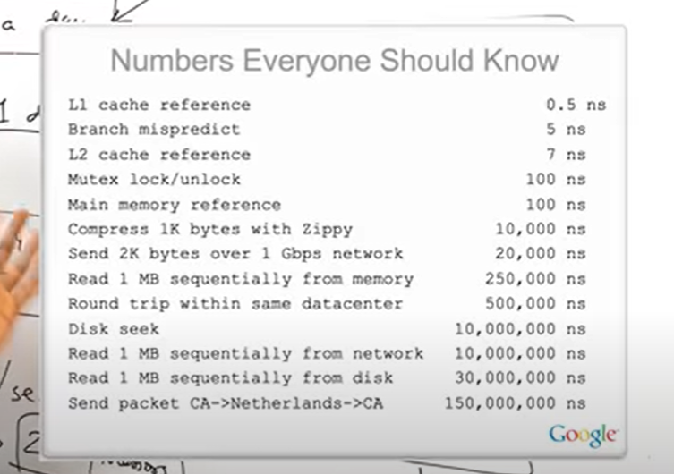
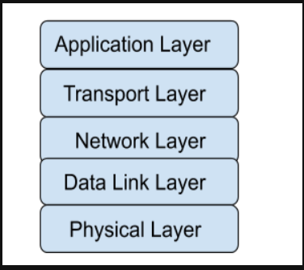

# What is System Design:
Systems Design is the process of defining the architecture, components, modules, interfaces, and data for a system to satisfy specified requirements. It involves translating user requirements into a detailed blueprint that guides the implementation phase.
## Scaling an application:
- Vertical Scaling: Optimizing processes and increasing throughput with the same resources.
- Preprocessing: Preprocessing before hand at non peak time.
- Backups: Keep backups and avoid single point failure. 
- Horizontal scaling: Hire more resources.
- Micro Services architecture: where the application is developed as a collection of services, every work is well defined.
- Distributed System: Partitioning.
- Load Balancer: a device that sits between the user and the server group and acts as an invisible facilitator, ensuring that all resource servers are used equally.
- Decoupling: separating the things.
- Logging and metrics calculations.
- Extensible.

### Heigh level design:
Explains the architecture that would be used to develop a system

### Low level design:
Actual coding, like making classes, objects, functions, signatures.

# Vertical Scaling and Horizontal scaling:
When our code is liked by users and want response for there request they interact with our code via API's, our code to be used by everyone in the world we need to use cloud servers like AWS etc.

Now if requesting are coming more, its time for scaling.

There are 2 types of scaling as the title suggest.

- Buying Bigger machine is Horizontal scaling.
- Buying more machines is Vertical scaling.

## Difference:
Horizontal scaling   |  Vertical scaling
---------------------|----------------------
Need a Load Balancer | Not needed
Resilience | Single point failure
Network calls (Remote procedural calls)| Inter process communication(ipc)
Data Inconsistency | Consistence
Scales well as users increase | Hardware limit

Finally we are going to used both the advantages to our application, that is we take goods form each.
- Resilience, Scales well as users increase from horizontal.
- Inter process communication(ipc), Consistence from vertical scaling.

That is we start with a vertical scaling and make it into horizontal based on demand.

# Capacity Estimation:
prerequisite:

terms used above are:

- L1 cache reference: This refers to accessing data from the Level 1 cache, which is the smallest and fastest cache memory in a computer's CPU.
- Branch mispredict: This occurs when a CPU incorrectly predicts the outcome of a conditional branch in code execution, leading to a performance penalty.
- L2 cache reference: Similar to L1, but refers to accessing data from the larger, slightly slower Level 2 cache.
- Mutex lock/unlock: A mutex (mutual exclusion) is a programming concept used to prevent multiple threads from simultaneously accessing shared resources. Locking and unlocking a mutex takes time.
- Main memory reference: This refers to accessing data from the computer's main RAM (Random Access Memory).
- Compress 1K bytes with Zippy: Zippy is a compression algorithm. This line shows the time taken to compress 1 kilobyte of data using this algorithm.
- Send 2K bytes over 1 Gbps network: This indicates the time required to send 2 kilobytes of data over a network with 1 gigabit per second bandwidth.
- Read 1 MB sequentially from memory: This refers to reading 1 megabyte of data in sequence from the computer's main memory.
- Round trip within same datacenter: This is the time taken for a data packet to travel from one server to another within the same datacenter and back.
- Disk seek: The time required for a hard disk drive's read/write head to move to the correct position to access data.
- Read 1 MB sequentially from network: Similar to item 8, but reading from a network instead of local memory.
- Read 1 MB sequentially from disk: Reading 1 megabyte of data in sequence from a hard disk drive.
- Send packet CA->Netherlands->CA: This represents the time for a data packet to travel from California to the Netherlands and back.

# HTTP and HTTPS protocols
HyperText Transfer Protocol(HTTP) is an application layer protocol that is used to access and transfer data(text, images, video, multimedia, etc) over the world wide web.

In HTTP, the client sends a request message to the server. After the client responds, HTTP establishes a TCP connection between the client and the server. HTTP delivers a request to the server, which collects the data that was requested. After the server sends data to the client, the connection will be terminated.

## Features of HTTP
- connectionless
- media independent
- stateless

# HTTPS
Hypertext Transfer Protocol Secure is a secure extension or version of HTTP that is used for providing security to the data sent over the world wide web.

This protocol allows transferring the data in an encrypted form which is particularly important when users transmit sensitive data such as login credentials.

# TCP model
Transmission Control Protocol/Internet Protocol(TCP/IP) is a practical network model.

TCP is a set of communication protocols that supports network communication.

The TCP model is subdivided into five layers, each containing specific protocols.

- **Physical Layer:**
The physical layer translates message bits into signals for transmission on a medium, i.e. the physical layer is the place where the real communication takes place.
    - For example, electrical signals are generated for copper cables, light signals are generated for optical fibers, and radio waves are generated for air or vacuum.
- **Data Link Layer(DLL):**
The DLL is subdivided into 2 layers: MAC(Media Access Control), LLC(Logical Link Control)
    - The MAC layer is responsible for data encapsulation(Framing) of IP packets from the network layer into frames. Framing means DLL adds a header(which contains the MAC address of source and destination) and a trailer(which contains error-checking data) at the beginning and end of IP packets.
    - LLC deals with flow control and error control. Flow control: Limits how much data a sender can transfer without overwhelming the receiver. Error Control: Error in the data transmission can be detected by checking the error detection bits in the trailer of the frame.
- **Network Layer:**
    - The network layer adds IP address/logical address to the data segments to form IP packets and **finds the best possible path** for data delivery. **IP addresses are addresses allocated to a device** to uniquely identify it on a global scale. 
    - Common protocols used in the Network layer are:
        - **IP(Internet Protocol):** IP uses the receiver’s IP address to determine the best path for the proper delivery of packets to the destination. When a packet is too large to send over a network medium, the sender host's IP splits it up into smaller fragments. The fragments are reassembled into the original packet on the receiving host. IP is unreliable since it does not ensure delivery or check for errors.
        - **ARP(Address Resolution Protocol):** ARP is used to find MAC/physical Addresses from the IP address.
        - **ICMP(Internet Control Message Protocol):** ICMP is responsible for error reporting.

- **Transport Layer:** 
    The transport layer is in charge of flow control (controlling the rate at which data is transferred), end-to-end connectivity, and error-free data transmission. 

    Protocols used in the Transport layer:
    - TCP(Transmission Control Protocol): 
        - TCP is a connection-oriented protocol, which means it requires the formation and termination of connections between devices in order to transmit data.
        - TCP segmentation means that at the sending node, TCP breaks the entire message into segments, assigns a sequence number to each segment, then reassembles the segments into the original message at the receiving end based on the sequence numbers.
        - TCP is a reliable protocol because it identifies errors and retransmits the damaged frames, and ensures data delivery in the correct order.
    - UDP(User Datagram Protocol):
        - UDP is a connectionless protocol, which means it does not require the establishment and termination of connections between devices.
        - UDP does not support segmentation and lacks error checking and correction which makes it less reliable but more cost-efficient.
- **Application Layer:**
This is the uppermost layer, which combines the OSI model's session, presentation, and application layers. Users can interact with the application and access network resources through this layer.
    - Protocols used in the Application layer:
        - HTTP(Hypertext Transfer Protocol): Protocol used to access data on the World Wide Web.
        - DNS(Domain Name System): This protocol translates domain names to IP addresses.
        - SMTP(Simple Mail Transfer Protocol): This protocol is used to send Email messages.
        - FTP(File Transfer Protocol): This protocol is used to transfer files between computers.
        - TELNET(Telecommunication Network): It is a two-way communication protocol connecting a local machine to a remote machine.